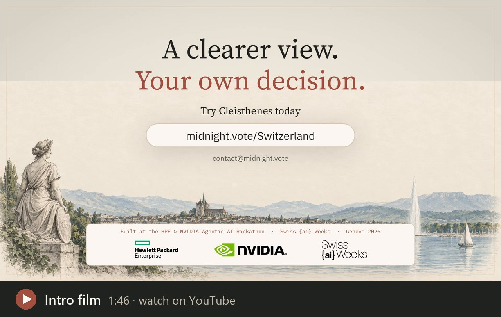
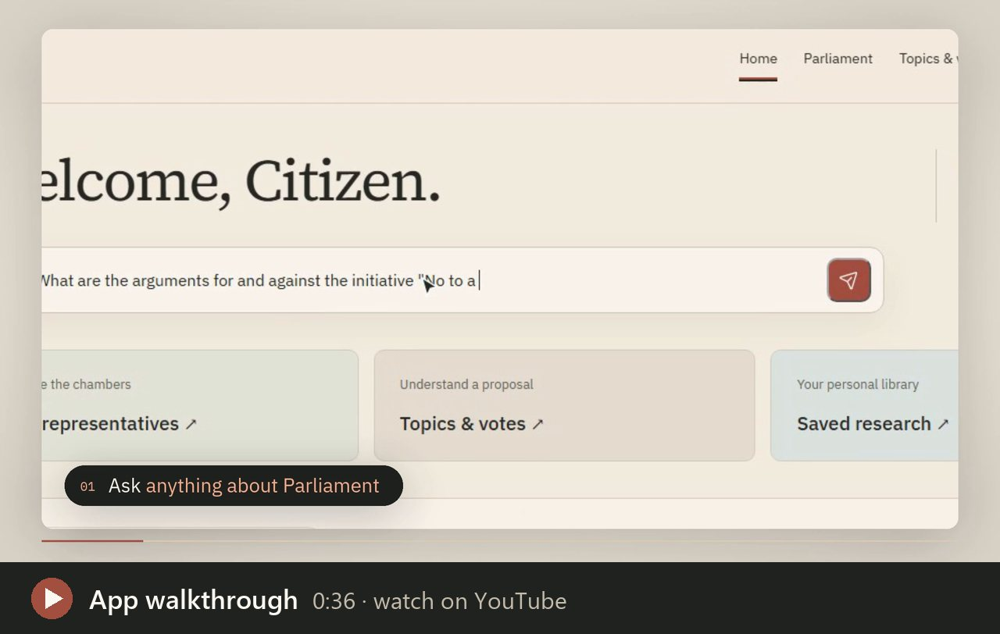
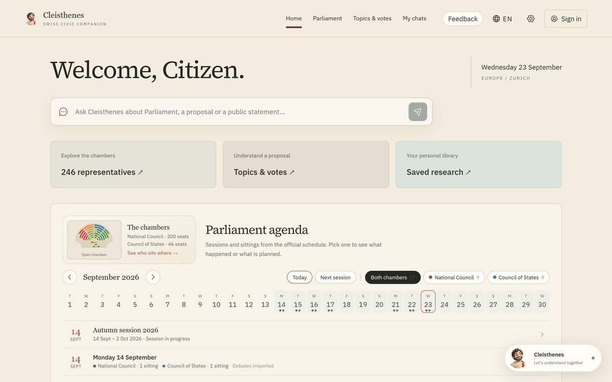
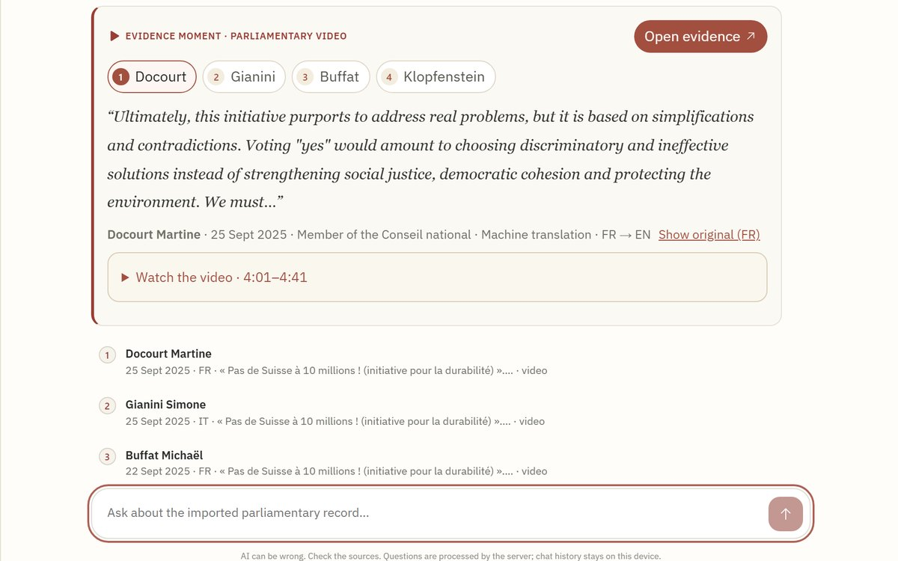
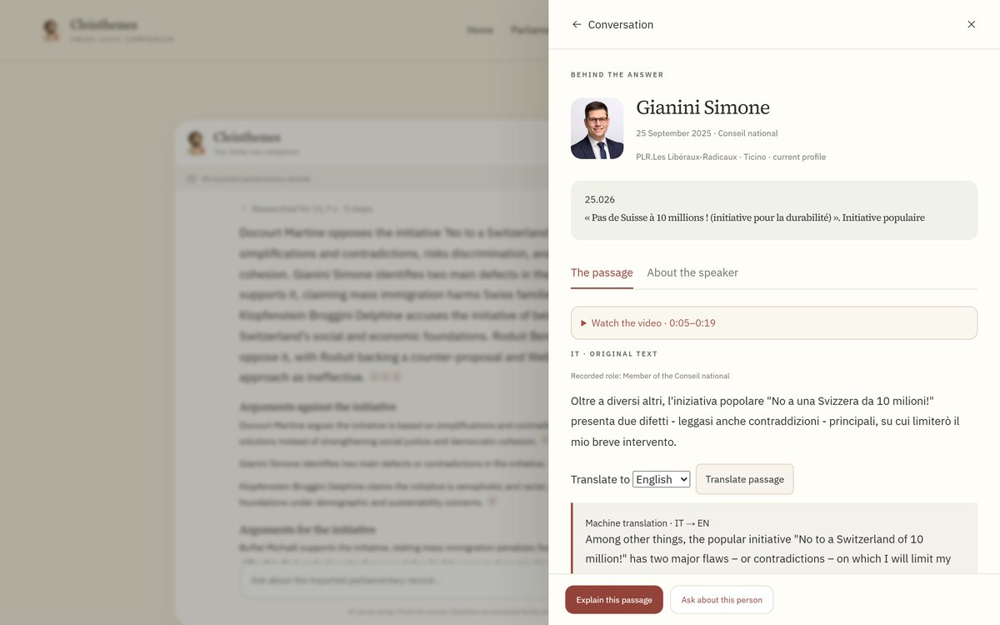
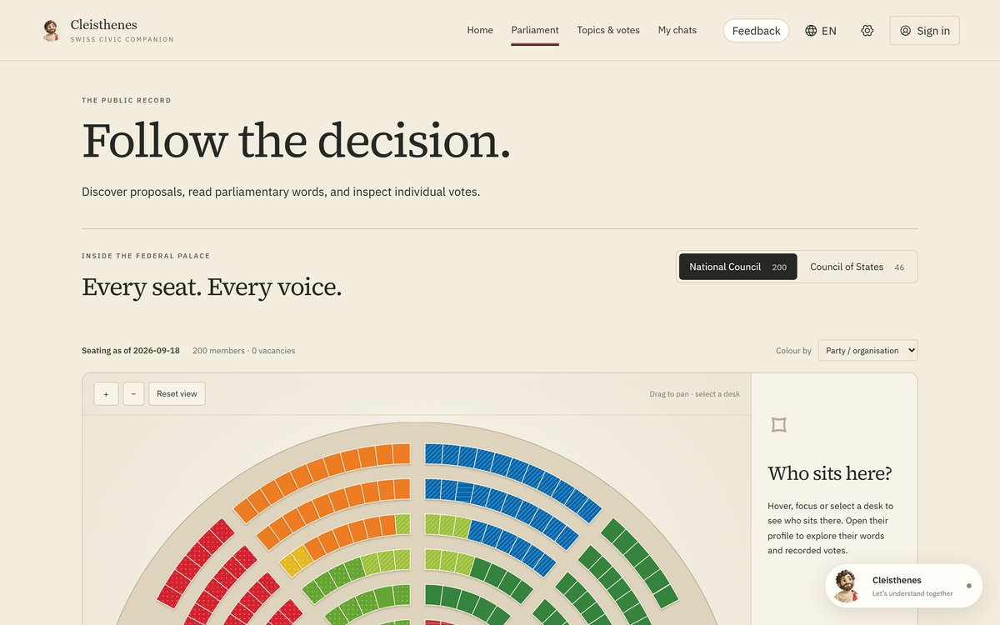

<div align="center">

# Cleisthenes

### A clearer view. Your own decision.

Your evidence-backed AI civic companion for understanding Swiss public decisions: ask in your language, get an answer built from the official parliamentary record, with the original words, the speaker and the exact video moment.

[Open the Swiss pilot](https://midnight.vote/Switzerland/) · [How it works](docs/HOW-CLEISTHENES-WORKS.md) · [How AI is used](docs/AI-IN-CLEISTHENES.md) · [Architecture](docs/ARCHITECTURE.md) · [Current status](docs/STATUS.md) · [Run locally](#run-locally)

[](https://youtu.be/HFW6X0y2rJw)

**▶ [Watch the intro film](https://youtu.be/HFW6X0y2rJw)** (1:46) · **▶ [Watch the app walkthrough](https://youtu.be/hy-n3Teu_Wk)** (0:36)

Independent Swiss pilot · Built during the HPE × NVIDIA Agentic AI Hackathon · Swiss {ai} Weeks

</div>

## Why Cleisthenes

Switzerland's Parliament publishes everything: every speech in the Official Bulletin, every individual vote, every proposal and hours of video, in French, German and Italian. It is authoritative, and in practice almost unreadable. A citizen who wants to know *what was actually argued* about an initiative has to search three languages, open dozens of transcripts and scrub through video.

Cleisthenes does that reading for you. You ask in your language; it searches the official record, reads the relevant speeches, checks every statement against its source and answers with numbered citations, the original words and, where available, the exact moment in the parliamentary video.

- **A guide, not an authority.** It explains what was said and by whom. It never tells you how to vote and never predicts results.
- **The public record is the evidence.** Official Bulletin text is what gets quoted. Machine transcripts, translations and video timings are aids, always labelled as such.
- **Honest about gaps.** When the record does not answer a question, Cleisthenes says so. News and upcoming sessions come from a separate web search, shown apart as *Beyond the parliamentary record*.

## See it in action

[](https://youtu.be/hy-n3Teu_Wk)

|  |  |
| :-- | :-- |
| **Home.** Ask anything; follow sessions and sittings on one agenda. | **Cited answer.** Switch between the cited speakers and jump to the exact second in the chamber video. |
|  |  |
| **The source.** The original words, the speaker and a labelled machine translation. | **Parliament.** Every seat, every member, every recorded vote. |

*Screenshots of the live pilot, 23 September 2026.*

## One question, step by step

*"What are the arguments for and against the initiative 'No to a Switzerland of 10 million'?"*

1. **Research, live.** Cleisthenes shows each step as it runs: understanding the question, searching 134 sessions in French, German and Italian, reading, checking statements, writing.
2. **The answer.** In about 20 seconds: a direct summary, a section for each side, and a numbered citation on every sentence.
3. **The evidence.** The evidence card plays each cited speaker from the official video at the exact moment, with the original words and a labelled translation.
4. **The source.** A citation opens the full passage in context: speaker, role, party and a link to the Official Bulletin.
5. **Follow-ups.** The conversation is remembered: *"What did he vote on it?"* is understood as a question about the same speaker and proposal.

## What you can do

| Area | What it offers |
| --- | --- |
| **Ask Cleisthenes** | Cited answers in EN, FR, DE and IT; evidence moments with video; translations; follow-ups that remember the thread; labelled web research for news and upcoming sessions. |
| **Home** | One Parliament agenda: sessions and sittings by day, colour-coded by chamber; one click asks what happened or what is planned. |
| **Parliament** | Verified seating of both chambers; 254 current members with full official profiles and complete vote histories, with what *yes* and *no* meant. |
| **Topics & votes** | Search across ~54,000 proposals in the archive, curated popular-vote dossiers and featured debates. |
| **My chats** | Every conversation in one place, on this device or synced when signed in. |

## How it works

**AI finds, reads, translates and explains. Plain code decides what counts as evidence.** The model never writes a citation, so it can't invent one. The full walkthrough, with diagrams, is in **[How Cleisthenes works](docs/HOW-CLEISTHENES-WORKS.md)**.

| Technology | What it does | What the reader gets |
| --- | --- | --- |
| **NVIDIA Nemotron Nano 9B v2** (NIM on H100) | Understands the question, writes search terms, checks claims, writes the answer, resolves follow-ups | Clear answers in your language, built only from checked sources |
| **NVIDIA Canary 1B v2** (H100) | Transcribes chamber video with a timestamp per word | 14,556 quotes linked to their exact video moment |
| **multilingual-e5-large** (indexed on H100, queried on CPU) | Places 1,140,943 passages on a map of meaning | Questions find the right speeches in any language |
| **NVIDIA Riva Translate** | Translates originals on request | Original words plus a labelled translation |
| **TypeSafe Jev** (shadow mode) | Independent claim-versus-source check | A second safety net against mistranslated claims |
| **Web search** | Only for news and upcoming sessions | Separate, labelled findings with links; never a citation |
| **Deterministic code** | Quotes, dates, roles, vote counts, citations, refusals | Every number and quotation is exact and traceable |

### Built on NVIDIA

- **Live answers:** Nemotron Nano 9B v2 as an NVIDIA NIM on an H100 (NVIDIA LaunchPad). When the GPU allocation ends, answers switch automatically to NVIDIA's hosted API catalog (Nemotron 3 Super 120B), tested end to end.
- **Bulk reading on the second H100:** the E5 meaning index of 1,140,943 passages in under ten minutes, and Canary speech recognition (11,092 recordings so far, still running).
- **After the hackathon:** search runs on an ordinary CPU (a 1.2 GB index, about one second per search over the whole archive). Nothing already processed is lost.

## Coverage and limits (23 September 2026)

- 185 official sessions declared (1990–2026); official text is searchable for **134 sessions (1999–2026, 1,140,943 passages)**. Older sessions have no digital transcript in the official service.
- 221,752 recording jobs; **11,092 transcribed** so far and **14,556 passages** with machine-aligned video moments, none yet human-reviewed.
- **254 of 254 current members** have complete official profiles and vote histories (790 people in total).
- A speech is one person's intervention, not a decision of Parliament. Missing vote records are not abstentions.

### Next: a privacy layer

Midnight is the future privacy layer, not the headline. Selective disclosure could later prove eligibility (for example Swiss citizen and 18+) for non-binding participation without revealing identity. Reading and asking never require it, and participation features stay clearly labelled as concepts.

## For developers

### Where the work happens

| Question | Entry point |
| --- | --- |
| Which API endpoint answers a question? | [`server/index.mjs`](server/index.mjs) (`POST /api/parliament/ask`, `/ask/stream`) |
| Where are retrieval, scope and follow-ups decided? | [`server/parliament-ai.mjs`](server/parliament-ai.mjs), [`server/conversation.mjs`](server/conversation.mjs) |
| Where is the answer synthesised and language-checked? | [`server/answer-synthesis.mjs`](server/answer-synthesis.mjs) |
| Semantic search and query embeddings | [`server/semantic-search.mjs`](server/semantic-search.mjs), [`server/query-embedding.mjs`](server/query-embedding.mjs) |
| Web research and the model fallback | [`server/web-research.mjs`](server/web-research.mjs), [`server/model-endpoint.mjs`](server/model-endpoint.mjs) |
| Bulk speech recognition and embeddings on the GPU | [`scripts/process-public-sessions.py`](scripts/process-public-sessions.py), [`scripts/embed-public-corpus-batched.py`](scripts/embed-public-corpus-batched.py) |
| Pulling GPU results back safely | [`scripts/pull-gpu-checkpoint.sh`](scripts/pull-gpu-checkpoint.sh) |

For the full request path and trust boundaries, read [Architecture and data provenance](docs/ARCHITECTURE.md); for the per-session matrix, [Current status](docs/STATUS.md).

### Run locally

Requirements: Node.js 22.13 or newer and npm. A GPU is optional for browsing and deterministic source access; live model-backed features require configured private services. Public databases, media and credentials are intentionally not committed.

```bash
npm ci --prefix frontend
npm run build --prefix frontend
npm start
```

Open `http://127.0.0.1:4318/`. The repository includes seeded example dossiers, while the operator's imported corpus remains under ignored `data/` artifacts.

Optional server-side configuration is documented in [`.env.example`](.env.example). Never put private provider keys in `VITE_*` variables.

To declare the archive, process its resumable text queue and reconcile profile gaps:

```bash
npm run archive:discover -- --from-year=1990 --to-year=2026
npm run archive:import:text -- --limit=5
npm run profiles:backlog
npm run profiles:enrich -- --limit=5
```

Read [the session pipeline](docs/SESSION-PIPELINE.md) before running media, ASR, alignment, VSS or embedding stages.

### Validate a change

```bash
npm run docs:check
npm test
npm run test:api --prefix frontend
npm run test:sites --prefix frontend
npm run build --prefix frontend
```

Operators with the ignored processing artifacts can reproduce the coverage table with `npm run docs:status`.

### Documentation

- [How Cleisthenes works](docs/HOW-CLEISTHENES-WORKS.md): the one-page walkthrough with diagrams
- [Developer documentation index](docs/README.md)
- [Product specification](docs/PRODUCT-SPEC.md)
- [Architecture and data provenance](docs/ARCHITECTURE.md)
- [Current implementation and corpus status](docs/STATUS.md)
- [Session, recording and GPU pipeline](docs/SESSION-PIPELINE.md)
- [Operations and deployment](docs/OPERATIONS.md)
- [Contribution and branch policy](CONTRIBUTING.md)
- [Historical implementation record](docs/archive/2026-09/README.md)

### Evidence and privacy rules

- Official text, ASR output, translation and generated explanation remain separate records.
- A current party membership never rewrites historical membership or turns a reported position into a personal position.
- Missing votes are not abstentions, and a recording URL is not an exact quotation timestamp.
- Queued, downloaded, transcribed, aligned, visually embedded and human-reviewed are separate states.
- Public evidence may be processed and indexed; private chats, accounts and feedback are not included.
- Provider failures and unsupported questions remain visible rather than being replaced with fabricated answers.

### Repository and licence

Work happens on short-lived branches in Tomas Garro's fork and reaches `main` through reviewed pull requests. The organization repository is never updated without explicit approval. See [CONTRIBUTING.md](CONTRIBUTING.md). The videos are also available as MP4 downloads in the [hackathon release](https://github.com/tomasgarro/swiss-parliament-intelligence/releases/tag/hackathon-2026-09-24).

This non-commercial civic pilot is independent and has no government affiliation. Parliamentary material comes from Swiss Parliamentary Services and remains subject to its [source usage conditions](https://www.parlament.ch/de/services/Seiten/Nutzungsbedingungen.aspx); credit **© ParlCH** and any named photographer. Model weights, fonts and third-party assets retain their own licences.
