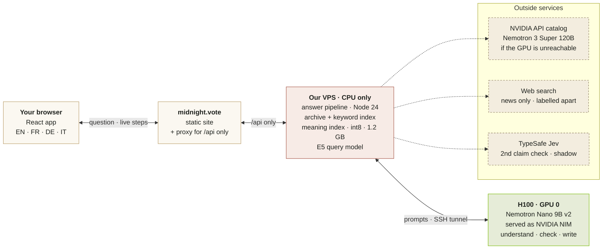
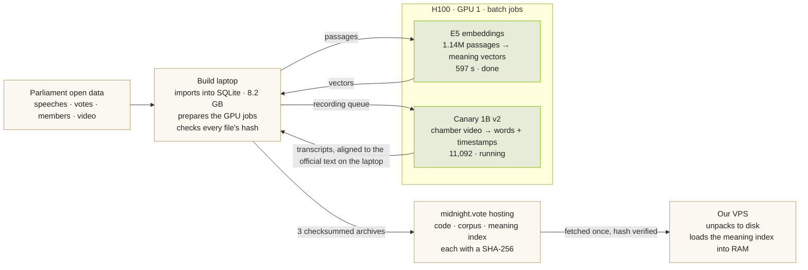
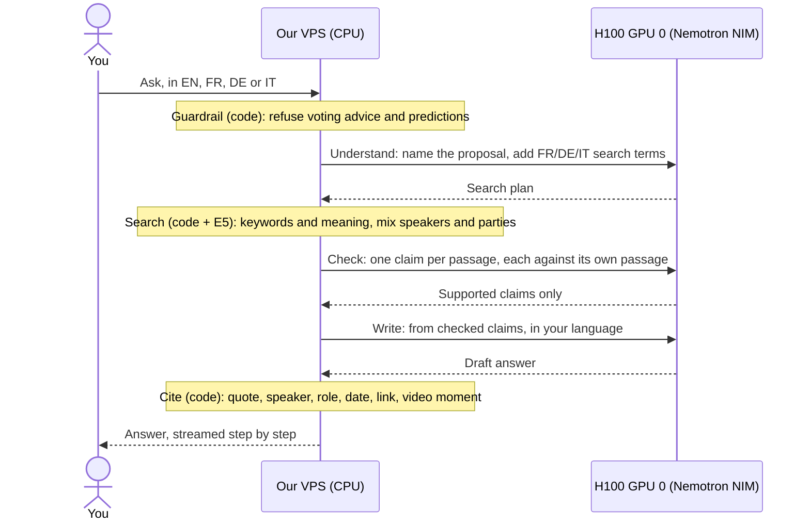

# How Cleisthenes works

You ask about the Swiss Parliament in English, French, German or Italian. Cleisthenes searches the official record, checks every claim against the passage it came from, and answers with a citation on every sentence. This page shows where each piece runs, what the two NVIDIA H100s did, and how we built it.

Figures as of 23 September 2026. They come from [Current status](STATUS.md), [How AI is used](AI-IN-CLEISTHENES.md) and [Operations](OPERATIONS.md).

*A real answer. Each sentence ends in a citation number. The evidence card quotes the official record and opens the chamber video at the second the words were spoken.*

| | |
| ---: | --- |
| **1,140,943** | speech passages, searchable by keyword and by meaning |
| **11,092** | chamber recordings transcribed on an H100 |
| **14,556** | quotes linked to their exact video second |
| **2 × H100** | one serves answers, one did the bulk reading |

**Watch it:** [intro film (1:46)](https://youtu.be/HFW6X0y2rJw) · [app walkthrough (0:36)](https://youtu.be/hy-n3Teu_Wk)

**On this page:**

1. [The rule](#1-one-rule-explains-most-design-choices)
2. [Where things live](#2-where-everything-lives)
3. [One question, step by step](#3-follow-one-question)
4. [Embeddings](#4-embeddings-search-by-meaning-across-languages)
5. [The H100s](#5-how-we-used-the-two-h100s)
6. [How we built it](#6-how-we-built-it)
7. [Status](#7-whats-live-and-what-isnt-yet)

## 1. One rule explains most design choices

**AI does the reading and writing. Plain code decides what counts as evidence.**

| What the AI does | What our code does |
| --- | --- |
| Understands the question and names the proposal it's about | Refuses "how should I vote?" before any model runs |
| Adds French, German and Italian search terms | Runs the searches and picks a mix of speakers and parties |
| Pulls one claim out of each passage it's given | Drops any claim that failed the check |
| Checks each claim against that exact passage | Attaches every quote, name, role, date, link and video time |
| Writes the answer in your language | Matches transcripts to the official text to find video moments |
| Transcribes chamber video; translates on request | |

The model never writes a citation, so it can't invent one. If the record doesn't say it, the answer doesn't either.

## 2. Where everything lives

Four machines and two paths: the live path every question takes, and the one-time path that got the data there.

### Every question: live

The VPS does the searching itself. It only goes to the GPU for the three model steps. Nothing else can reach the GPU: the tunnel forwards three ports and has no shell.

### Once, offline: how the data got onto the VPS

The expensive reading happened once, on GPU 1. From then on, serving needs only a CPU server plus one model. That's why search, transcripts and video moments survive the end of the GPU allocation.

### What sits on each machine

**Our VPS** · Hostinger KVM 2 · 2 CPUs · 8 GB RAM · Docker project `swiss-civic-pilot`

| Component | Detail |
| --- | --- |
| Node 24 API: the answer pipeline | one container, 4 GB memory cap |
| Speech archive + keyword index (SQLite) | 1.1 GB compressed |
| Meaning index, int8 vectors | 1.2 GB, in RAM |
| E5 query model (ONNX) | runs on the CPU |
| Model keys (NVIDIA, OpenAI) | set in the hosting panel only, never in the repository |

**NVIDIA LaunchPad node** · 2 × H100 NVL · 128 CPU threads · ~1 TiB RAM · until 25 September

| Component | Detail |
| --- | --- |
| GPU 0: Nemotron Nano 9B v2 (NIM) | live answers |
| GPU 1: Riva Translate | translations on request |
| GPU 1: Cosmos video search | experiment |
| GPU 1: Canary worker and its queue | running |
| Full-precision E5 vectors | stay on the node |

**midnight.vote hosting** · Hostinger shared hosting · `public_html/Switzerland/`

| Component | Detail |
| --- | --- |
| The React site (static files) | `index.html` + assets |
| `proxy.php` | forwards only `/Switzerland/api`; not an open proxy |
| Release archives the VPS pulls | `bootstrap/<sha256>.tgz` |

**Build laptop** · the repository checkout with its ignored `data/` folder

| Component | Detail |
| --- | --- |
| Full corpus with revision history | `parliament.sqlite`, 8.2 GB |
| Validated Canary transcripts | 290 MB |
| Text sent to the GPU for embedding | 963 MB |
| Copy of the int8 meaning index | `data/embeddings/` |

## 3. Follow one question

Example: *"What are the arguments for and against 'No to a Switzerland of 10 million'?"* The request moves between the VPS and GPU 0 six times. On the live pilot it takes about 20 seconds (21 s measured on 23 September), and the reader watches each step as it happens.

Only the three GPU round trips need the H100. Searching 1.14 million passages happens on the VPS's CPU.

| Step | Runs on | What happens | In the example |
| --- | --- | --- | --- |
| Guardrail | VPS · code | Rules catch voting advice and predictions and refuse before any model sees the question. | Not advice, so it continues. "Should I vote yes?" would stop here. |
| Understand | GPU 0 | Recognises a named proposal; adds FR/DE/IT search terms; rewrites follow-ups into full questions. | Matched to official business 25.026. |
| Search | VPS · code + E5 | Keyword search in three languages plus meaning search, merged into one ranking; then a mix of speakers and parties is picked. | 1,149 passages from that debate considered. |
| Check | GPU 0 | One claim per passage, each reviewed against its own passage. Unsupported claims are dropped. Jev can score each one too, but only logs. | Claims that survive go to the writer. |
| Write | GPU 0 | Writes only from the checked claims, in the reader's language, or says the record is silent. | "Arguments against / Arguments for", in English. |
| Cite | VPS · code | Attaches exact quote, speaker, role, date, official link and video moment. | 4 cited: Docourt, Gianini, Buffat, Klopfenstein Broggini. |

## 4. Embeddings: search by meaning, across languages

An embedding is a list of 1,024 numbers that captures what a passage means. Passages about the same topic get similar numbers, even in different languages. So an English question lands next to the French and German speeches that answer it, even with no words in common. Think of it as a map: closer means more similar.

We used the open model `intfloat/multilingual-e5-large`, pinned to one exact revision. It indexed every passage once on the H100, and a CPU copy of the same model reads each new question on the VPS.

Embeddings only find candidates. Whether a passage supports a claim is decided later, in the Check step.

### Built once on the GPU, served every time on a CPU

| Where | Step | What happens | Result |
| --- | --- | --- | --- |
| Laptop | Export | Every passage, marked with `passage:` as E5 expects | 1,140,943 rows · 963 MB |
| H100 · GPU 1 | Embed | Long speeches split into 512-token windows that overlap by 64 | 1,141,140 vectors · 597 s |
| H100 · GPU 1 | Shrink | Each number stored in 1 byte (int8) instead of 4 | 5.6 GB → 1.2 GB |
| Hosting | Ship | Index + query model in one checksummed archive | SHA-256 verified |
| VPS · CPU | Serve | Loaded into RAM; 2 threads compare the question with every vector | ≈1 s per search |

**Shrinking kept the meaning.** The int8 vectors match the full-precision originals at 0.995 cosine similarity, so the ranking barely moves.

**Meaning plus keywords beats keywords alone.** On 8 test questions (48 result slots), keyword search alone found 35 on-topic passages; keywords plus meaning, which is what runs today, found 40.

**Where the embeddings live:**

- On the VPS, in RAM: the 1.2 GB file of vectors, a list of which passage each row belongs to, and a small manifest with the model revision and SHA-256 hashes.
- No vector database. It's a flat file of bytes, scanned in full on every question: exact results, no approximate index to tune.
- At question time, the question gets `query:` in front, goes through the CPU copy of E5 (about 35 ms), and is scored against all 1.14 million vectors. The top 40 are merged with the keyword results by reciprocal rank fusion.
- The full-precision originals stay on the H100 node. The laptop keeps a copy of the int8 index.
- Only public parliamentary text is embedded. Chats, accounts and feedback never are.

## 5. How we used the two H100s

One GPU serves the product; the other did the bulk reading. The split is deliberate: when the allocation ends, only the first job needs a replacement.

**NVIDIA LaunchPad node** · Ubuntu 24.04 · 128 CPU threads · ~1 TiB RAM · 2 × H100 NVL, 94 GB each · allocation ends 25 September

| GPU | Job | Detail | State |
| --- | --- | --- | --- |
| GPU 0 | Nemotron Nano 9B v2, packaged as an NVIDIA NIM | Understands, checks and writes every answer · about 20 s per researched answer | live |
| GPU 1 | E5 embeddings | 1,140,943 passages in 597 s (~1,900 per second) | done |
| GPU 1 | Canary 1B v2 speech-to-text | 5-minute audio windows, a timestamp per word · 11,092 of 221,752 recordings validated and imported | running |
| GPU 1 | Riva Translate 4B | Labelled translation next to any original | on request |
| GPU 1 | Cosmos Embed | Visual scene search in chamber video; not used in answers | experiment |

**How the VPS reaches it:** three model ports on the node's loopback, forwarded over an SSH tunnel by a dedicated account with no shell. Nothing else is reachable.

The Canary worker keeps transcribing until the allocation ends. New transcripts count only after they are pulled back, validated and imported.

### How a quote gets its video second

| | |
| --- | --- |
| **Canary heard** | 1:14 *En clair, l'immigration de masse ne se limite pas à saturer nos routes…* 1:47 |
| **Official Bulletin** | "En clair, l'immigration de masse ne se limite pas à saturer nos routes et nos hôpitaux…" |
| **Our code** | ≥ 85% of words match → accept → ▶ Watch the video · 1:14–1:47 |

We always quote the Bulletin, never the transcript; the transcript only supplies the timing. All 14,556 moments are labelled "machine-aligned, review pending".

### What changes on 25 September

| | Until 25 September | After 25 September |
| --- | --- | --- |
| Answers | Nemotron Nano 9B on GPU 0 · about 20 s | Nemotron 3 Super 120B on NVIDIA's API catalog · 25–48 s · tested end to end; the key is configured on the VPS |
| Search + meaning index | VPS CPU | Unchanged |
| Transcripts + video moments | Kept on the VPS | Unchanged |
| New transcription | Running on GPU 1 | Paused until we have GPU time again |
| Translation | Riva on GPU 1 | Not connected to a hosted service yet |

## 6. How we built it

Ten days, a small team, and AI coding agents (Codex, then Claude Code) writing most of the code, running the tests and preparing deploys. The team set priorities, made the product calls and approved every deploy and push.

| Date | Milestone |
| --- | --- |
| 14 Sep | **Kickoff.** Inspected the LaunchPad node (clean: no NIM or Riva yet). Defined who it's for and the first prototype screens. |
| 17 Sep | **First source-linked answers.** Nemotron answering from real speeches, plus a first video search. |
| 18 Sep | **First public release.** Live at midnight.vote/Switzerland with chamber maps and inline cited video. |
| 19–22 Sep | **Accounts, docs and a verified baseline.** Sign-in and saved chats; three sessions fully processed (16,224 passages, 3,327 transcripts) as the reference set. |
| 23 Sep | **Full archive, meaning search, final deploy.** 134 sessions and 1.14 million passages imported; E5 index built in 597 s; keyword + meaning search; conversation memory; NVIDIA catalog fallback; deployed with semantic search and labelled web research. |

Stack: React + Vite · Node 24 with no framework · SQLite with full-text search · Python jobs on the GPUs · Docker on the VPS · 111 automated tests · deploys rehearsed in Docker first.

Rules we kept throughout: no invented numbers or citations; machine output always labelled; keys never in chat or in the repository.

## 7. What's live, and what isn't yet

| Feature | State | Note |
| --- | --- | --- |
| Cited answers in EN, FR, DE, IT | live | Refuses voting advice and predictions |
| Keyword + meaning search | live | 134 of 185 sessions have official text (1999–2026) |
| Follow-ups that remember the thread | live | Shows "Understood as …" so the reader sees how it was read |
| Parliament explorer | live | 254 of 254 current members with profiles and vote histories |
| Video moments | live | 14,556, machine-aligned, not yet reviewed by a person |
| Web research for news | live | Separate block, "Beyond the parliamentary record"; enabled on 23 September |
| Transcription of the rest | running | 11,092 of 221,752 recordings |
| Jev second check | shadow | Scores and logs, never edits; 7 of 8 right on our test set; not enabled on the live pilot |
| Cosmos visual search | experiment | Not used in answers |
| Midnight Passport + anonymous temperature check | vision | Not in the pilot; a passport chip carries nationality and birth date, not canton |

### Known limits

- **The 9B model is cautious.** Broad questions sometimes get "not enough evidence". The 120B fallback finds more but is slower.
- **One attribution slip.** A National Councillor was once presented as speaking for the Federal Council. The fix is a role-aware check.
- **Pronouns in follow-ups.** "What did she say?" can pick the wrong speaker. Anchor follow-ups on the proposal in demos.
- **A pilot, not a product.** One small server, no load testing. Video moments still need a human review pass.

### If someone asks

**Isn't this ChatGPT with a search box?** No. It can only use passages retrieved for that question, each claim is checked against its source, and code attaches the citations.

**Where does OpenAI come in?** Only for news and upcoming sessions, which the parliamentary record can't cover. Those findings appear in their own labelled block and never become numbered citations. It is not a fallback for answers; answers always come from NVIDIA models.

**What did the GPUs actually do?** GPU 1 read the archive once: the meaning index in under ten minutes and 11,092 recordings transcribed. GPU 0 serves every live answer.

**What happens after the hackathon?** Answers move to NVIDIA's hosted catalog. Search, transcripts and video moments keep running on our CPU server.

**Where's Midnight in this?** Not in the pilot. It's the next step: proving you're eligible for a citizen poll without revealing who you are.

### Words used on this page

| Term | Meaning |
| --- | --- |
| Official Bulletin | Parliament's verbatim record of debates. The only text we quote. |
| NIM | NVIDIA Inference Microservice: a packaged, optimised model server. |
| Embedding | 1,024 numbers describing what a passage means. |
| int8 | One byte per number instead of four, so the index fits a small server. |
| Reciprocal rank fusion | Merging the keyword ranking and the meaning ranking into one list. |
| Shadow mode | A check that runs and logs but can't change the answer yet. |
| Canary | NVIDIA speech-to-text model; gives each word a timestamp. |
| LaunchPad | NVIDIA's hosted GPU environment for the hackathon, until 25 September. |

---

Cleisthenes · [midnight.vote/Switzerland](https://midnight.vote/Switzerland/) · contact@midnight.vote · figures as of 23 September 2026 · video moments are machine-aligned and not yet human-reviewed
